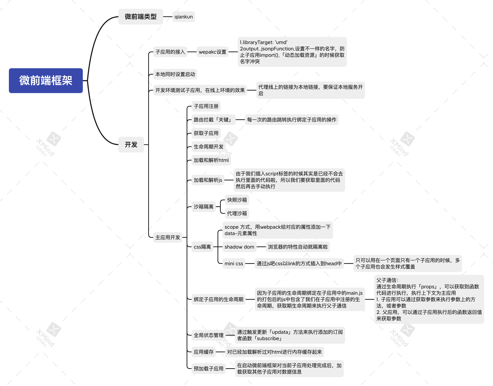

# micro_web_test

### 介绍功能
微前端库目录：qiankun-toy/main/micro



#### 启动
```shell script
# 根目录下
npm start 正常启动
npm start-f 强制刷新依赖并启动
```

#### 主项目

- main 主项目。


#### 子项目分类
- vue2子应用
- vue3子应用
- react15子应用
- react16子应用
- service 服务端
- platform 发布平台
